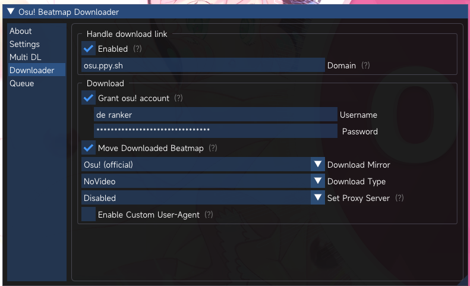
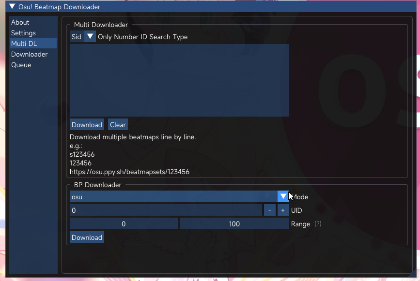
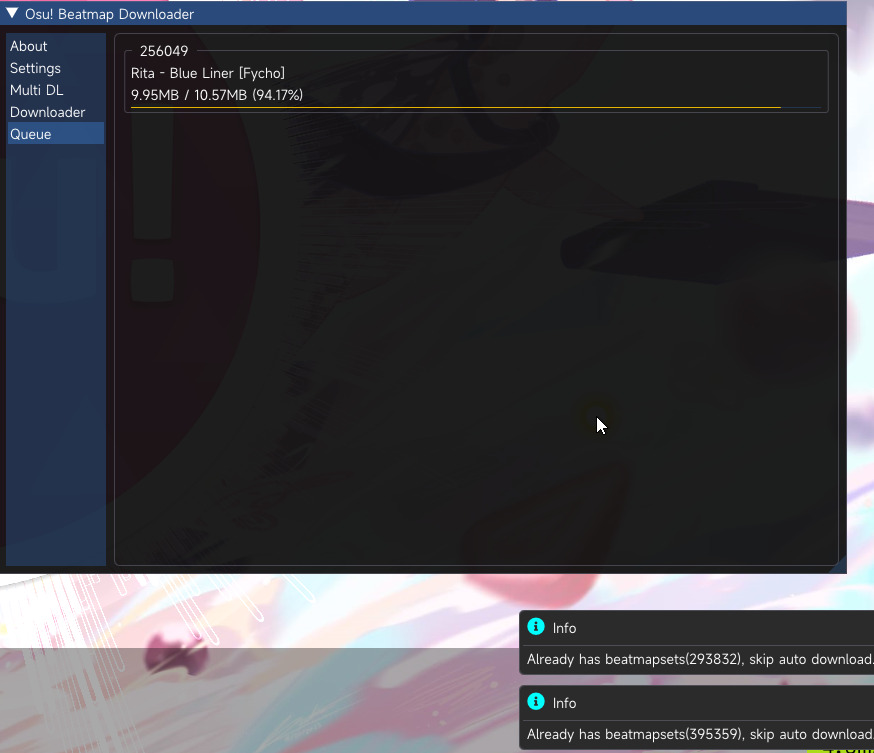

# BeatmapDownloader

An in-game beatmap downloader for osu!stable    
[中文介绍点这里](README_zh_cn.md)

## Usage

1. Download the latest release from [here](https://github.com/KyuubiRan/BeatmapDownloader/releases)
2. Extract the zip file
3. Run `osu!.exe`
4. Run `Injector.exe`
5. Enjoy!

## TODO / Features

- [x] Handle link
- [x] Sayobot Search & Download
- [x] Bancho Search & Download
- [x] Sid/Bid quick search
- [x] Multi beatmap download
- [x] BP download
- [ ] (Maybe) Compatibility mode support
- [ ] (Maybe) Chimu(Bloodcat) Search & Download

## UI

## Thanks

Osu-Ingame-Downloader: https://github.com/veritas501/Osu-Ingame-Downloader
