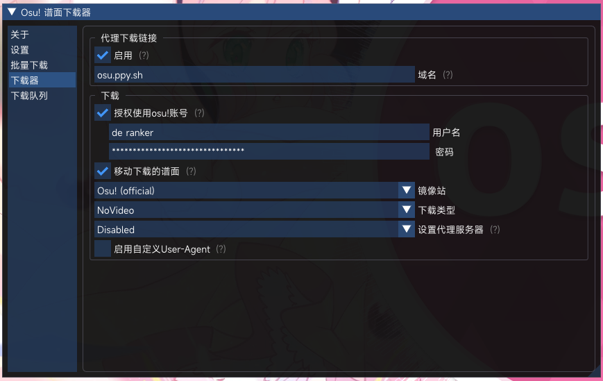
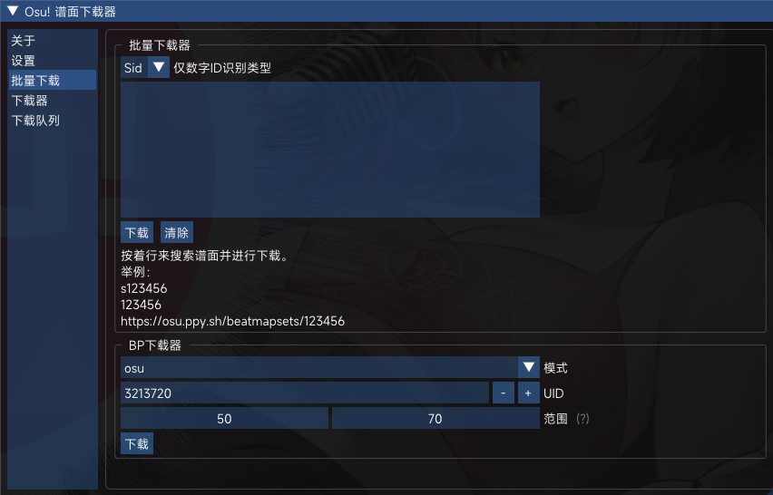
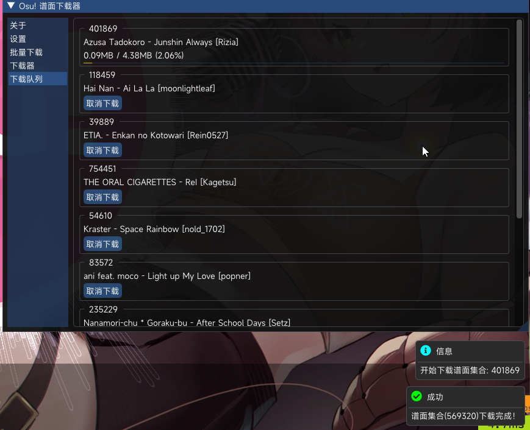

# BeatmapDownloader

一个游戏内谱面下载器  
[介绍视频](https://www.bilibili.com/video/BV1kP411i7An) by JunMoyan

## 如何使用

1. 从[此处](https://github.com/KyuubiRan/BeatmapDownloader/releases)下载最新版本
2. 解压zip文件
3. 运行 `Injector.exe`
4. 选择 `osu!.exe`
5. 完工！

## 待做事项 / 功能

- [x] 处理游戏内链接（也支持拖动官网连接到游戏内解析）
- [x] Sayobot 搜索/下载
- [x] Bancho 搜索/下载
- [x] Chimu(Bloodcat) 搜索/下载 by [EnergoStalin](https://github.com/EnergoStalin)
- [x] Sid/Bid 搜索
- [x] 批量下图
- [x] 一键扒BP
- [x] 收藏谱面下载
- [x] 指定谱师谱面下载
- [x] 玩家最多游玩的谱面下载
- [ ] (也许) 适配兼容模式

## 界面

## 贡献者

## 鸣谢

Osu-Ingame-Downloader: https://github.com/veritas501/Osu-Ingame-Downloader

Sakura 主题 by [Small-Ku](https://github.com/Small-Ku)
